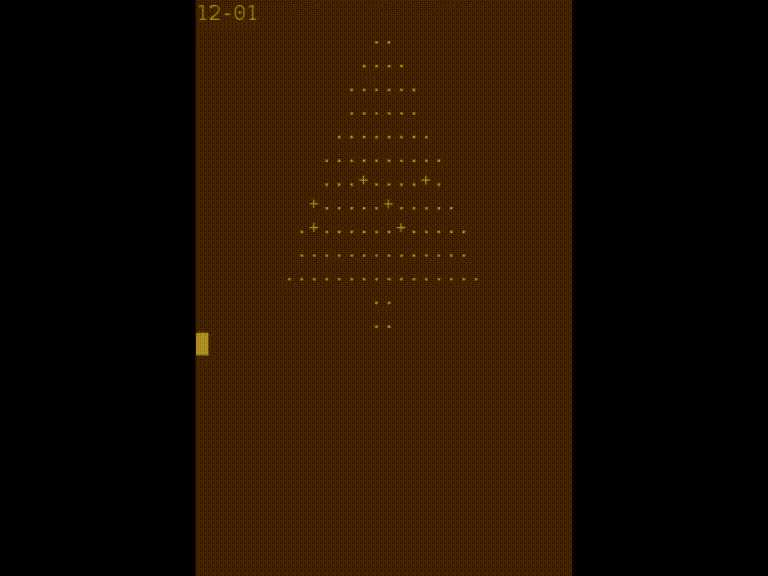

# perl_xmas.pl
Short perl script for drawing christmas tree in different size depending on the month and day.

I use this script as a greeting in my .zshrc in the christmas time.



# Usage

## Simple

The script will run from 01.12 until 31.01 and the tree will get the full size on 25.12.

```
./perl_xmas.pl
```

## Demo

This will animate the 2 month of the tree 20 seconds.

```
./demo.sh
```